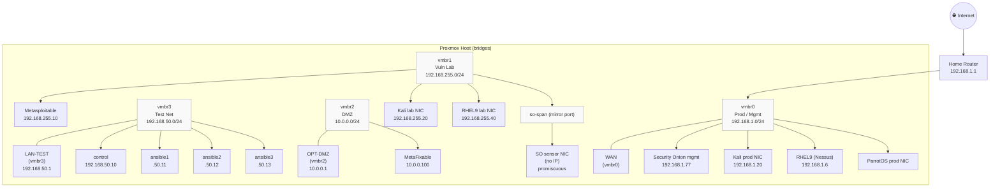

## Trial and error, and more trials and more errors...
coming soon...

## Diagram (changes pending..)
!

```mermaid
---
config:
layout: dagre
---
flowchart TD
subgraph subGraph0["Proxmox Host (bridges)"]
direction TB
vmbr0["vmbr0<br>Prod / Mgmt<br>192.168.1.0/24"]
vmbr3["vmbr3<br>Test Net<br>192.168.50.0/24"]
vmbr2["vmbr2<br>DMZ<br>10.0.0.0/24"]
vmbr1["vmbr1<br>Vuln Lab<br>192.168.255.0/24"]
so_span["so-span (mirror port)"]
pfWAN["WAN<br>(vmbr0)"]
pfLAN["LAN-TEST<br>(vmbr3)<br>192.168.50.1"]
pfDMZ["OPT-DMZ<br>(vmbr2)<br>10.0.0.1"]
vmbr0 --- pfWAN
vmbr3 --- pfLAN
vmbr2 --- pfDMZ
vmbr0 --> SO["Security Onion mgmt<br>192.168.1.77"] & KaliProd["Kali prod NIC<br>192.168.1.20"] & RHEL9Prod["RHEL9 (Nessus)<br>192.168.1.6"] & ParrotProd["ParrotOS prod NIC"]
vmbr3 --> control["control<br>192.168.50.10"] & ans1["ansible1<br>.50.11"] & ans2["ansible2<br>.50.12"] & ans3["ansible3<br>.50.13"]
vmbr2 --> MetaFixable["MetaFixable<br>10.0.0.100"]
vmbr1 --> Metasploitable["Metasploitable<br>192.168.255.10"] & KaliLab["Kali lab NIC<br>192.168.255.20"] & RHEL9Lab["RHEL9 lab NIC<br>192.168.255.40"] & so_span
so_span --> SOSensor["SO sensor NIC<br>(no IP)<br>promiscuous"]
vmbr0:::bridge
vmbr3:::bridge
vmbr2:::bridge
vmbr1:::bridge
so_span:::bridge
classDef bridge fill:#f9f9f9,stroke:#999,stroke-width:1px
end

HomeGW --> vmbr0
Internet(("🌐 Internet")) --> HomeGW["Home Router<br>192.168.1.1"]
```
## Why do this?
## Future Plans
- Local DNS